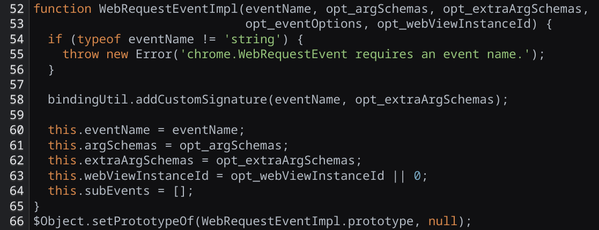

## About MV3

If you know anything about browsers, you've probably heard that Google Chrome is phasing out MV2 in favor of MV3. You've probably also heard that this hurts adblockers.

A quick explainer: "MV" stands for "manifest version." MV3 introduces a new type of runtime for Chrome extensions that, among other things, gets rid of `webRequestBlocking`, a permission that allows extensions to block requests dynamically based on their content (which [its replacement](https://developer.chrome.com/docs/extensions/reference/api/declarativeNetRequest) does not support). Adblockers heavily rely on `webRequestBlocking` to function properly. Pretty convenient (cough cough) for a company that makes most of its revenue from ads to be removing that.

Anyway, with the phasing-out of MV2 pretty much done, now seems like a good time to talk about a bug in Chrome that I found and reported to Google in 2023. [The bug](https://issues.chromium.org/issues/40926777) let `webRequestBlocking` (and yes, adblockers) work in MV3.

So here we go.

## Stop writing browsers in JavaScript

Yes, Chrome is written in C++. However, extensions are written in JavaScript, and the API functions they call look just like JavaScript functions, at least from the extension's point of view. But they aren't normal functions: they're special and do browsery C++ stuff through bindings. In theory, this should be safe.

But in the old days, Google decided it'd be a good idea to inject a bunch of JS files into pages that used Chrome APIs. These "extension binding modules" would initialize API functions and validate arguments before passing them to the browser.

(Note: [here's the codebase](https://source.chromium.org/chromium/chromium/src/+/dc42ae208c2744f7fb144b2e396358a1fc34db87:extensions/renderer/resources/) of those files in 2016.)

Turns out running privileged JavaScript in user-controlled websites was not a good idea, because JS can often be manipulated by overriding global functions and prototypes. Since certain APIs like `chrome.runtime` exist on normal websites too, the extension bindings system led to multiple Universal XSS bugs back in 2015 and 2016. [Here's one](https://issues.chromium.org/issues/40083765) that allows any website to inject code into any other website. Truly crazy stuff. If only I weren't 8 years old back then... maybe I could have cashed in.

Anyway, Google learned from their mistake and moved most API bindings to pure C++. However, a couple of JS binding files still exist and are used today. For example, if a Chrome extension runs the following code, it'll hit a [JS loop](https://source.chromium.org/chromium/chromium/src/+/60039d4d4bd70512e21a2dfe586602aca1d9d35e:extensions/renderer/resources/permissions_custom_bindings.js;l=46;bpv=0;bpt=0) and hang infinitely: (as of July 2025)

```js
chrome.permissions.contains({ permissions: { length: Infinity }})
```

Maybe you are wondering what this has to do with adblockers.

Remember how I said only a few APIs still use JavaScript bindings? `chrome.webRequest` is one of them.

## The bug

This is how an MV2 extension would block requests to example.com:

```js
chrome.webRequest.onBeforeRequest.addListener(() => {  
    return { cancel: true }  
}, { urls: ['*://*.example.com/*'] }, ['blocking'])
```

It's the `'blocking'` part at the end that requires the `webRequestBlocking` permission, and therefore isn't allowed in MV3. Without it, the `cancel: true` does nothing.

So clearly adding a blocking listener to the `chrome.webRequest.onBeforeRequest` event does not work anymore. But we can do something crazy. We can make **our own event.** Now, this should not be possible; it's not even a concept that makes sense. But, because of how the JS bindings work, you can do it. For some reason, there is a [wrapper class](https://source.chromium.org/chromium/chromium/src/+/main:extensions/renderer/resources/web_request_event.js;l=52;drc=f52b068efda528bf42d0b7d245674deb99ee58ba) for `webRequest` events that contains some extra state.



(A [note on the security](./wrei-note.txt) of the above code.)

Instead of doing pure bindings between JS and C++, the browser creates one of these classes for every `chrome.webRequest` event: `onBeforeRequest`, `onCompleted`, etc. Surprisingly, the `.constructor` of these events is still public. It points to yet another wrapper class, which internally calls `WebRequestEventImpl` (from the code above). You can use this to can create a new event with your own properties:

```js
let WebRequestEvent = chrome.webRequest.onBeforeRequest.constructor
let fooEvent = new WebRequestEvent("foo")
```

There is still a lot of validation going on in the backend when you try to actually do things with these fake events. For example, trying to add a listener to `fooEvent` kills the extension's process, because the event name is invalid. So how do you manipulate the properties of `WebRequestEventImpl` to do anything interesting?

After a lot of time looking into the C++ code, I found exactly one vulnerable thing: the `opt_webViewInstanceId` parameter. This was set for Chrome platform apps, in order to let them manage their embedded websites (WebViews). Among other things, it let them use web request blocking to control navigation. Basically, if an event had a WebView ID, the permission check for `webRequestBlocking` [would be skipped](https://source.chromium.org/chromium/chromium/src/+/main:extensions/browser/api/web_request/web_request_api.cc;drc=3d26531172e5deb179e524cc9d7035153d3eb4b3;l=722). The issue was that the browser never verified that an event with a WebView ID actually belonged to a platform app. So an extension could spoof it, skip the check, and use the blocking feature.

```js
let WebRequestEvent = chrome.webRequest.onBeforeRequest.constructor

// opt_webViewInstanceId is the 5th argument
let fakeEvent = new WebRequestEvent("webRequest.onBeforeRequest", 0, 0, 0, 1337)

fakeEvent.addListener(() => {  
    return { cancel: true }  
}, { urls: ['*://*.example.com/*'] }, ['blocking'])
```

Maybe I should note that platform apps were **deprecated in 2020.** I found this bug in 2023, and the code to handle `opt_webViewInstanceId` still exists in 2025. Goes to show how ancient code leads to bugs.

## What could have happened, and what happened

Technically, someone could have used this bug to make a perfectly working adblocker in MV3 by simply replacing all instances of `chrome.webRequest.onBeforeRequest` with `fakeEvent`. This would have been very funny, after all the hype about how adblockers were being killed. However, I think a big adblocker extension even considering using something like this was extremely unlikely, for two reasons:
- If they get found out, there's a decent chance Google uses that as an excuse to take them off the Web Store. ("Used an active security vulnerability on x million users, blah blah...")
- It's an extremely temporary solution. Eventually they'll have to actually migrate to MV3, so it's hard to see what they gain by trying to exploit a bug for a couple weeks at most.

In the end, I figured nobody would realistically be able to use this long-term and so I decided to [report the issue to Google](https://issues.chromium.org/issues/40926777) in August 2023. It was patched in Chrome 118 by [checking whether](https://source.chromium.org/chromium/chromium/src/+/main:extensions/browser/api/web_request/web_request_api.cc;l=722;bpv=1;bpt=0;drc=40cc134ade29c59e86399520db9d252e79058a3c;dlc=ccbf0af81b332209d276725c17e381a76acb9b1c) extensions using `opt_webViewInstanceId` actually had WebView permissions. For the report, I netted a massive reward of $0. They decided it wasn't a security issue, which is unlucky but fair enough.


(Shown above: my earnings from this bug.)

Anyway, it was a fun one, and it really shows how a few lines of code can sometimes bypass a big update by a big company. I hope you found it interesting!
